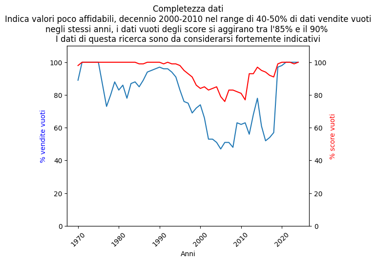

# 🎮 **analisi su vendite e recensioni del mercato videogiochi**
Un caso studio su come distinguere un vero trend da un problema di assenza di dati.

*Il mercato non sta calando: sono i dati a essere incompleti*

***

## CONTENUTI:
  1. [storia](#la-storia).
  2. domanda
  3. dati 
  4. strumenti
  5. [risultato](@-il-risultato)

***

###  📕 **la storia**
SoftAlex è una software house che vuole produrre un nuovo videogioco.

Il grande successo della loro prima produzione indie, "Tartis", ha portato loro molti fondi. E questo comporta molte scelte da fare...

### ❓ **quale genere di gioco è meglio produrre?**
SoftAlex vuole esplorare la storia del mercato dei videogiochi e la sua situazione attuale per scegliere il genere del loro nuovo capolavoro.

### 📁 **i dati**
Da dove arrivano i dati:
- Vendite storico: ci sono tanti dataset sull'argomento, alcuni di essi riportano dati non realistici. Dopo attente ricerche ho selezionato questo per la sua ricchezza.
  
  **link**: [Dataset Gigasheet](https://app.gigasheet.com/spreadsheet/video-game-sales-1978---2024/b3ac0e84_314a_4900_a79d_d2fd8dc49381?referrerId=https%3A%2F%2Fwww.gigasheet.com%2Fsample-data%2Fvideo-game-sales-1978---2024&_gl=1*1v5gwy6*_gcl_au*OTM3MTUzMTUwLjE3ODU4NDE0MDI.)
  
- Vendite attuali: Ho scelto un sito che mostra i dati sui giochi di Steam, la principale piattaforma per il gaming da PC. Utile per capire l'attuale andamento del gaming, soprattutto online.
  
  **link**: [SteamSpy API](https://steamspy.com/)

  
### 🧑‍💻 **strumenti**
Formato: Notebook Jupyter

Esplorazione, raggruppamento e trasformazione: Python(Pandas e Numpy) - SQL (sqlite3)

Visualizzazione: Matplotlib

### 📋 **il risultato** 
I dati ci dicono che i gamer adorano i giochi di azione, shooter, strategici e GDR.

🛑 **Attenzione** Nonostante la coerenza dell'output, i dati mostrati **NON** possono essere considerati affidabili al 100%. 
L'assenza di una parte importante dei dati di vendita e il disclaimer nella pagina about di SteamSpy suggeriscono di prendere i risultati come un'indicazione, da validare con altri metodi.
  

